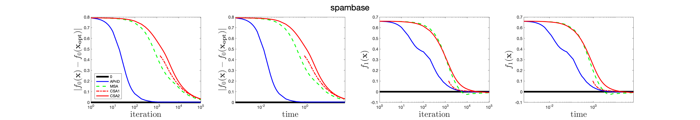
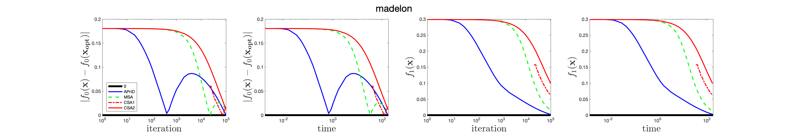
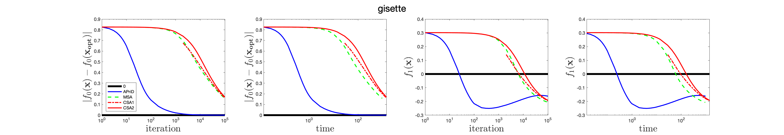
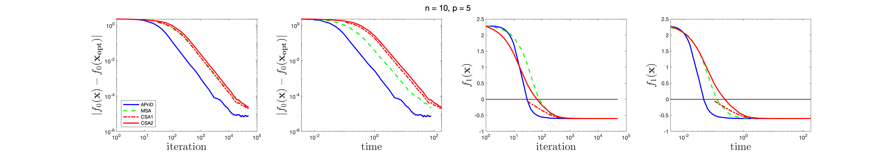
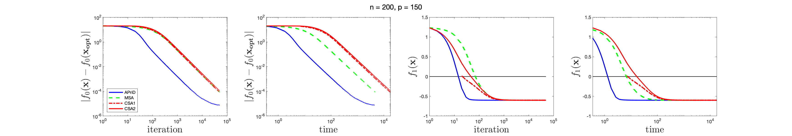
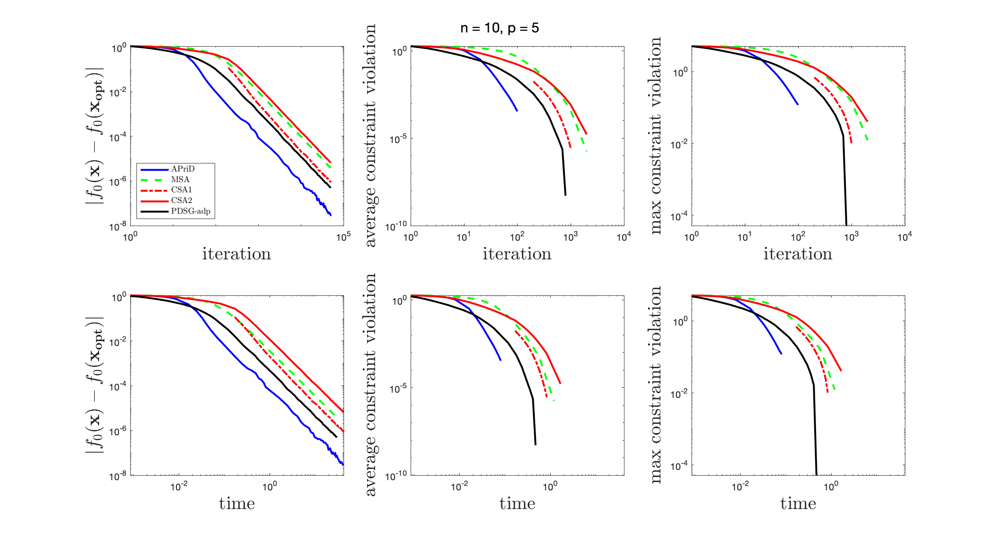
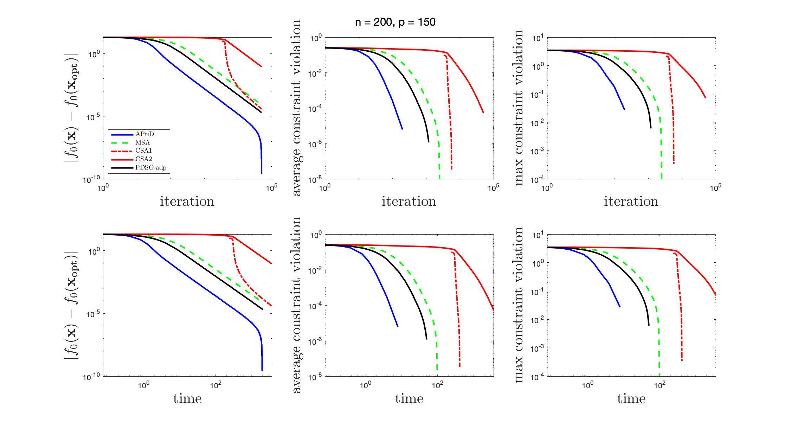

# APriD

This repository is the implementations of the paper: Adaptive Primal-Dual Stochastic Gradient Method for Expectation-constrained Convex Stochastic Programs.

## Requirements
Our implementations are in Matlab R2019a. 
For QCQP problems, CVX is used to get the optimal solution. CVX is a Matlab-based modeling system for convex optimization. We download CVX from http://cvxr.com/cvx/download/. Particularly, we use the mosek solver in CVX, which needs a license. See http://cvxr.com/cvx/doc/mosek.html for details.

## Content 

In the paper, we test our algorithm on 3 problems: Neyman_Pearson Classification Problem in a finite-sum form, the quadratically constrained quadratic program (QCQP) whose objective and constraint are both in an expectation form, and QCQP with scenario approximation. 
Three folders in this repository are corresponding to the three problems.

- The folder "Neyman_Pearson" includes all code for the Neyman-Pearson Classification Problem. 
> - data_set includes the preprocessed data sets {'spambase', 'madelon'} ('gisette' is not uploaded beacuses it is larger than 25MB). 
> - iALM_NP.m is the deterministic method iALM which gives an optimal  solution.
> - NP_class_ApriD.m, NP_class_CSA.m, NP_class_MSA.m  are ApriD, CSA, MSA methods, respectively.
> - compare_algs_NP_class.m runs all the above methods and plot_compare_algs_NP_class.m plots the results for a given data set's filename in {'spambase', 'madelon', 'gisette'}.
> - select_parameters_NP_class.m runs ApriD method with different parameters and plot_select_parameters_NP_class.m plots the results for a given data set's filename in {'spambase', 'gisette'}.

- The folder "QCQP_expect" includes all code for QCQP in Expectation Form.  
> - QCQP_expect_ApriD.m, QCQP_expect_CSA.m, QCQP_expect_MSA.m are ApriD, CSA, MSA methods, respectively.
> - compare_algs_QCQP_expect.m runs all the three methods and plot_compare_algs_QCQP_expect.m plots the results for a given n in {10, 200}.
> - select_parameters_QCQP_expect.m runs ApriD method with different parameters and plot_select_parameters_QCQP_expect.m plots the results for a given n in {10, 200}.

- The folder "QCQP_scenar" includes all code for QCQP in finite-sum structured QCQP with many constraints.  
> - QCQP_scenario_ApriD.m, QCQP_scenario_CSA.m, QCQP_scenario_MSA.m, QCQP_scenario_PDSG_adp are ApriD, CSA, MSA, PDSG_adp methods, respectively.
> - compare_algs_QCQP_scenario.m runs all the three methods and plot_compare_algs_QCQP_scenario.m plots the results for a given n in {10, 200}.

- Besides the four folders, the repository includes "run_all.m" includes how to run the experiments.

## Usage
- Run "run_all.m" to produce all the results in the paper. 
- Or in each folder, run compare_algs_\*.m to comprare the different algorithms for the problem \*; and run select_parameters_\*.m to compare the results of ApriD with different parameters for the problem \*;
- Or in each folder, run each algorithm singly for the problem.

## Performance
On Matlab R2019a installed on a 2016 13-inch MacBook Pro with one 2.9 GHz Dual-Core Intel Core i5 processor and 16 GB memory. 

### Neyman-Pearson Classification Problem

### QCQP in Expectation Form

### Finite-sum structured QCQP with many constraints

 
